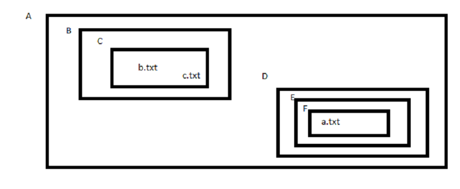

## RUTAS RELATIVAS Y RUTAS ABSOLUTAS - EJERCICIOS

1. Estando en B acceder a b.txt usando ruta relativa

2. Estando en C acceder a F usando ruta absoluta

3. Estando en F acceder a A usando ruta relativa

4. Estando en D acceder a c.txt usando ruta absoluta

5. Estando en C acceder a a.txt usando ruta abosulta

6. Estando en C acceder a a.txt usando ruta relativa

7. Estando en E acceder a E usando ruta absoluta

8. Estando en E acceder a E usando ruta relativa

9. Estando en E acceder a D usando ruta relativa

10. Estando en E acceder a F usando ruta relativa

11. Estando en E acceder a F usando ruta absoluta
