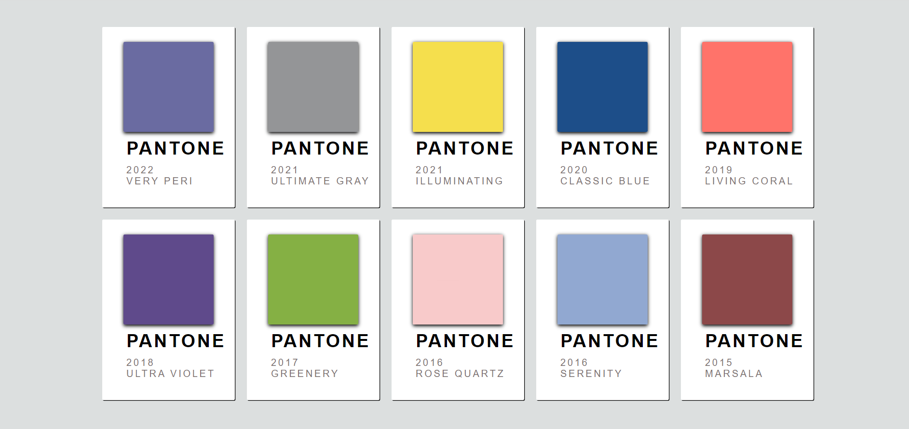

# EJERCICIOS: 

**1.** Hacer los ejercicios del juego de las ranas: https://flexboxfroggy.com/#es 

**2.** Hacer en parejas el mismo formato que aparece en la siguiente pantalla:

<!--[COLORES]()-->

#### RECURSOS

* Teoría con ejemplos: https://cssreference.io/

* Recomendados:  https://developer.mozilla.org/es/docs/Web/CSS/flex-direction

[WEB_EJEMPLOS_NACHO_COKE](https://fs-abr-22-taller-flex-box.netlify.app/)
