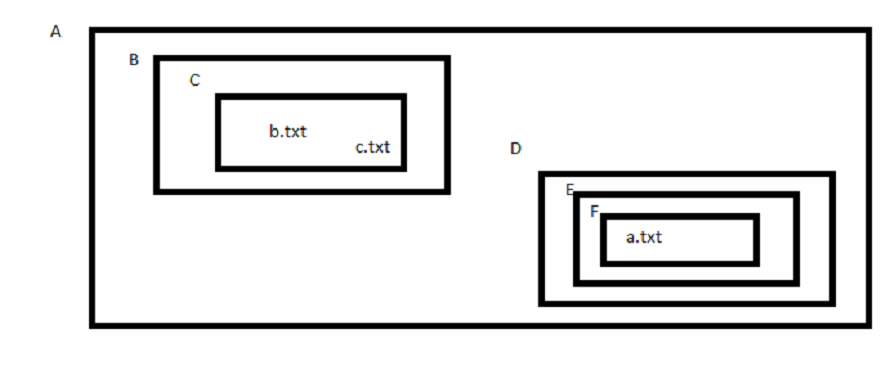

## RUTAS RELATIVAS Y RUTAS ABSOLUTAS - EJERCICIOS Y SOLUCIONES

<p></p>


1. Estando en B acceder a b.txt usando ruta relativa.
```
A/B> ./C/b.txt
```
2. Estando en C acceder a F usando ruta absoluta.
```
A/B/C> A/D/E/F
```
3. Estando en F acceder a A usando ruta relativa.
```
A/D/F> ../../../
```
4. Estando en D acceder a c.txt usando ruta absoluta.
```
A/D> A/B/C/c.txt
```
5. Estando en C acceder a a.txt usando ruta absoluta.
```
A/B/C> A/D/E/F/a.txt
```
6. Estando en C acceder a a.txt usando ruta relativa.
```
A/B/C> ../../D/E/F/a.txt
```
7. Estando en E acceder a E usando ruta absoluta.
```
A/D/E> A/D/E
```
8. Estando en E acceder a E usando ruta relativa.
```
A/D/E> ./
```
9. Estando en E acceder a D usando ruta relativa.
```
A/D/E> ../
```
10. Estando en E acceder a F usando ruta relativa.
```
A/D/E> ./F
```
11. Estando en E acceder a F usando ruta absoluta.
```
A/D/E> A/D/E/F
```