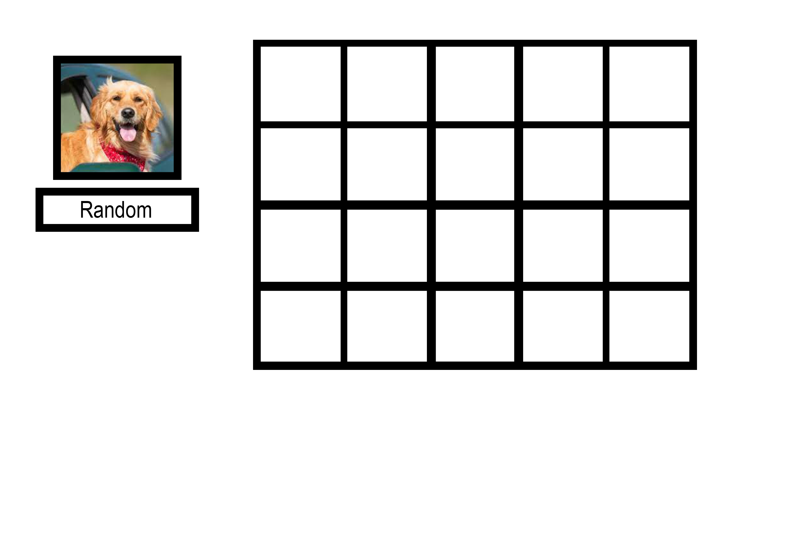
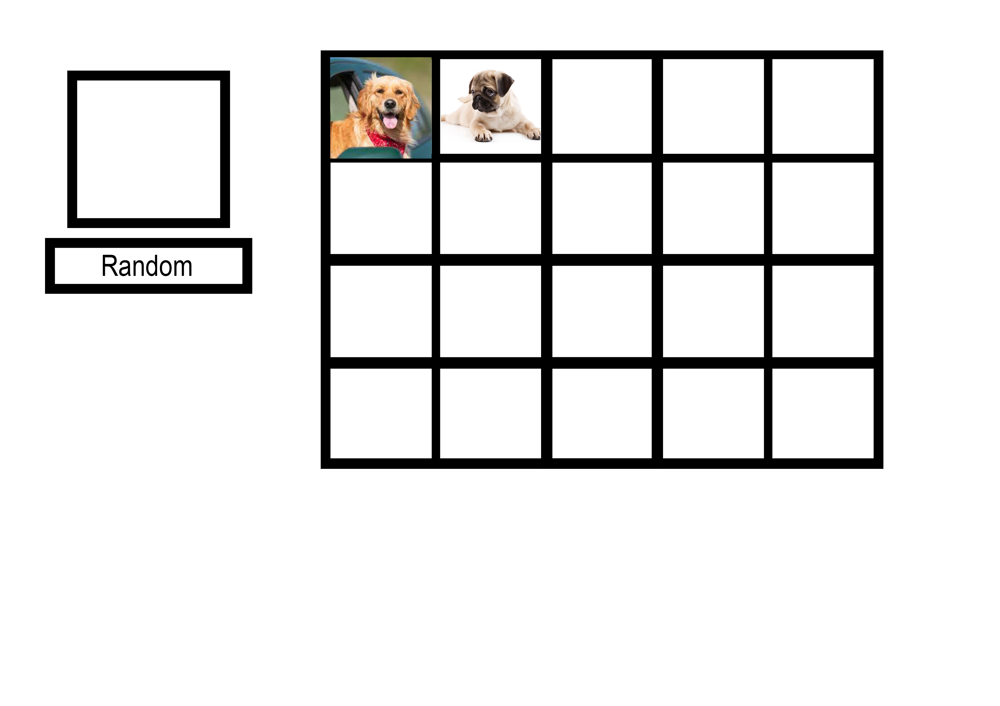

# Promesas, JSON, Local Storage y Gráficas 

Utilizando la siguiente API: https://dog.ceo/dog-api/ 

Que devuelve imágenes aleatorias, habrá que ir coleccionando diferentes razas de perros pulsando un botón e ir rellenando una matriz (4x5) como la que se ve en las imágenes.

Se va añadiendo cada imágen a una casilla, además de almacenar los perros que van apareciendo para poder sacar estadísticas al final.

Cuando se haya completado todo el álbum aparecerá una gráfica de todas las razas que han salido y la de veces que se han ido contando.

Las imágenes ilustran el funcionamiento, pero la apariencia de la aplicación depende del grupo y se debe cuidar tanto como el funcionamiento; además se deben usar conocimientos de Flexbox y Grid en la medida de las posibilidades del diseño.

