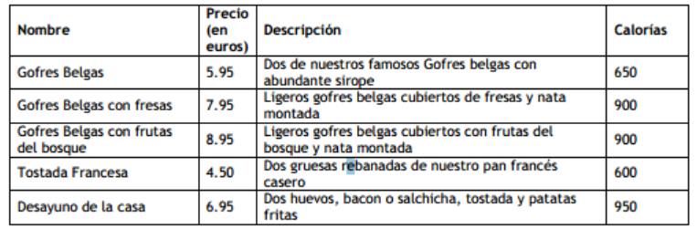

# Ejercicios 
1. Crea en Firebase Firestore una BD que almace la información del ejercicio 3 de JSON. 

- Enunciado del ejercicio: 

A partir de la siguiente información, diseña y elabora un JSON que la contenga y permita acceder de manera lo más sencilla posible, a precio y calorías de cada desayuno.

## SOLUCIÓN

